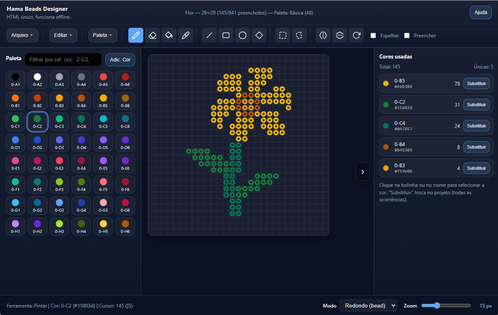
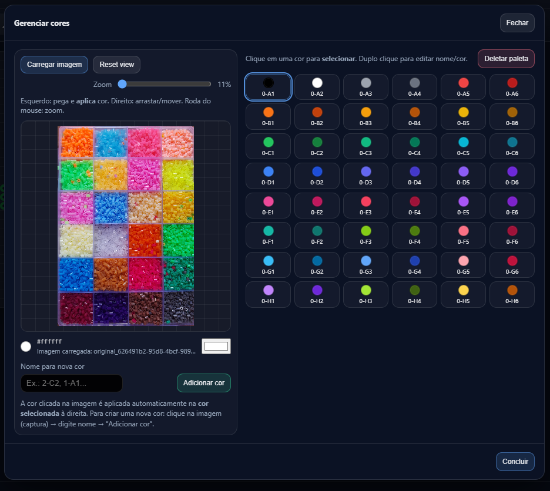

# Hama Perler Beads Designer 🎨

[Acesse o link](https://vagnerdaniel.github.io/Hama-Perler-Beads-Design/Hama_Beads_Designer.html)

O **Hama Perler Beads Designer** é uma ferramenta web poderosa e intuitiva para criar padrões de Hama Beads (perler beads). Desenvolvido como um arquivo HTML único, ele funciona totalmente offline e oferece um conjunto completo de ferramentas para artistas de pixel art e entusiastas de beads.

## ✨ Principais Funcionalidades

### 🖌️ Ferramentas de Desenho Completas
*   **Pincel [B]**: Desenho livre ponto a ponto.
*   **Borracha [E]**: Remova beads individualmente ou com clique direito.
*   **Balde de Tinta [F]**: Preencha áreas conectadas com uma única cor.
*   **Formas Geométricas**: Crie Linhas, Retângulos e Elipses perfeitas.
*   **Polígono [Enter]**: Desenhe formas complexas conectando pontos.
*   **Preencher**: Opção para desenhar formas sólidas ou apenas o contorno.

### 📐 Edição e Seleção
*   **Seleção Retangular [M]**: Mova ou delete blocos de beads.
*   **Seleção Livre (Laço) [L]**: Selecione áreas de qualquer formato.
*   **Transformações**: Gire 90°, Inverta Horizontalmente ou Verticalmente a seleção ou o board inteiro.
*   **Espelhamento**: Desenhe em simetria horizontal em tempo real.
*   **Desfazer/Refazer Infinito**: Sistema de histórico robusto (`Ctrl+Z` / `Ctrl+Y`).

### 🎨 Gestão de Cores e Paletas
*   **Gerenciador de Cores**: Extraia cores diretamente de qualquer imagem carregada.
*   **Conta-gotas [I]**: Capture cores existentes no board.
*   **Substituição Inteligente**: Troque todas as ocorrências de uma cor no projeto por outra.
*   **Importação/Exportação**: Salve suas paletas personalizadas em arquivos `.json`.

### 🖼️ Recursos Avançados
*   **Imagem → Beads**: Converta fotos e imagens em padrões de beads automaticamente com algoritmos de dither e quantização.
*   **Exportação PNG**: Gera uma imagem do seu projeto com fundo transparente e uma lista detalhada de materiais (quantas beads de cada cor você vai precisar).
*   **Modos de Visualização**: Alterne entre o modo **Bead** (redondo), **Pixel** (quadrado) ou **Melted** (finalizado).
*   **Autosave**: Seu progresso é salvo automaticamente no navegador.

## ⌨️ Atalhos Principais

| Tecla | Ação |
| :--- | :--- |
| **B** | Ferramenta Lápis |
| **E** | Borracha |
| **F** | Balde de Tinta |
| **I** | Conta-gotas |
| **P** | Polígono |
| **Ctrl + Z** | Desfazer |
| **Ctrl + S** | Salvar Projeto |
| **Delete** | Limpar Tudo |
| **Setas** | Mover Seleção |

---
*Desenvolvido para facilitar a criação e o planejamento de projetos de Hama Perler Beads com precisão profissional.*
